## Introduction

In this episode, we are going to build a Blazor WebAssembly application, and I am going to show you how to manipulate audio and video files using `FFmpegBlazor`.

`FFmpegBlazor` provides the ability to utilize `ffmpeg.wasm` from a Blazor WebAssembly application using C#, to leverage all the benefits of `ffmpeg`.

At the end of this demo, we are going to be able to extract the audio track of an MP4 video and create an MP3 audio file, create an MP4 video from an image and an audio track, add a watermark to a video, and concatenate two videos into one, all inside the browser.

Stay tuned, the end results will look like this:

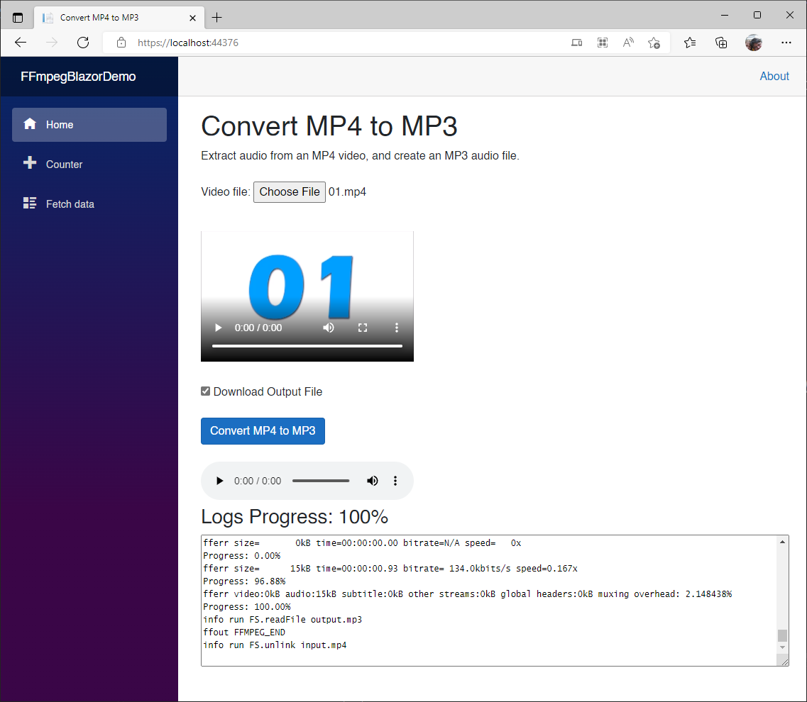  

Let's get to it.

## Prerequisites

The following prerequisites are needed for this demo.

### .NET 6.0

Download the latest version of the .NET 6.0 SDK [here](https://dotnet.microsoft.com/en-us/download).

### Latest Visual Studio 2022

For this demo, we are going to use the latest version of [Visual Studio 2022](https://visualstudio.microsoft.com/vs/community/).

### ASP.NET and web development Workload

In order to build Blazor apps, the `ASP.NET and web development` workload needs to be installed.

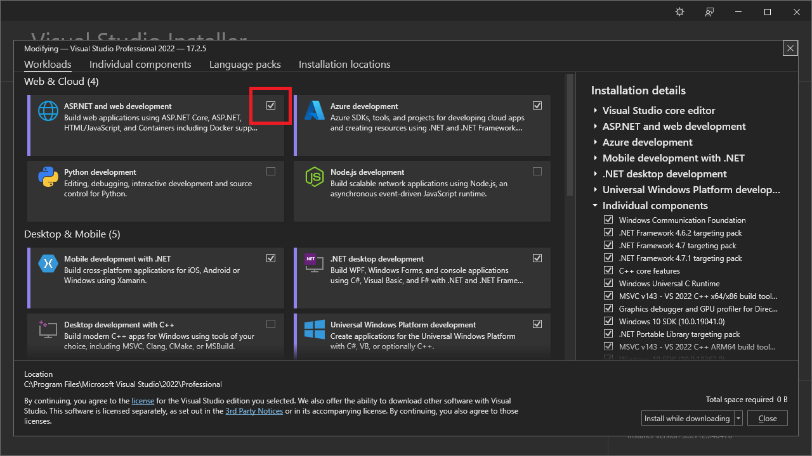  

### FFmpegBlazor

We are also going to use the [FFmpegBlazor](https://www.nuget.org/packages/FFmpegBlazor/) NuGet package for this demo.

## Demo

In the following demo we will create a Stand-Alone Blazor WebAssembly application, and I will show you how to use `FFmpegBlazor` to edit video and audio right from the browser.

### Create a Stand-Alone Blazor WebAssembly Application 


Name it `FFmpegBlazorDemo`

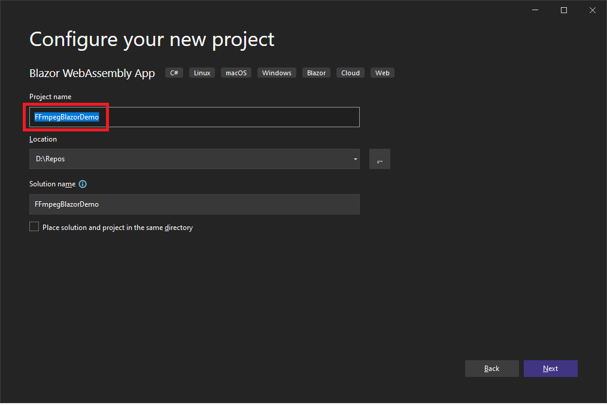  

To create a stand-alone WebAssembly app, make sure you do **NOT** select `ASP.NET Core hosted` on the next screen.


Add a NuGet reference to `FFmpegBlazor` library.


  

>:blue_book: You can also run `dotnet add package FFmpegBlazor` from the NuGet Package Explorer or the `Command Prompt`.

From the `FFmpegBlazor` NuGet docs:

>"FFmpegBlazor provides ability to utilize ffmpeg.wasm from Blazor Wasm C#.
ffmpeg.wasm is a pure Webassembly / Javascript port of FFmpeg. It enables video & audio record, convert and stream right inside browsers.
FFmpegBlazor integrates nicely with Blazor InputFile Component. Supports Lazy loading of ffmpeg binary. It is self hosted version one time download of core ffmpeg wasm lib will be 25Mb."

What that means is, on first load, we are only going to see a couple of tiny JavaScript files being downloaded.

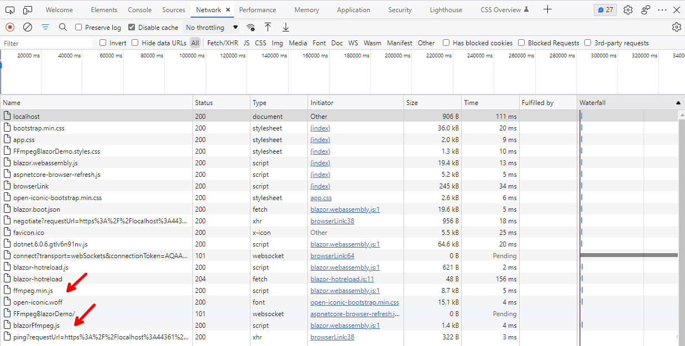  

Then, when we actually use the library, the 25 MB core FFmpeg WASM library will be downloaded, on demand.

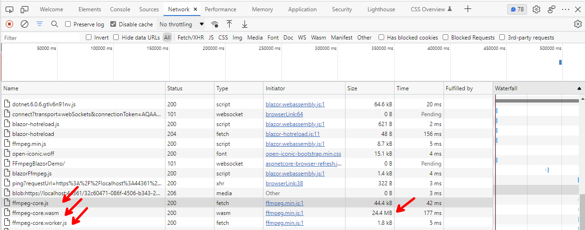  

As you can see, the 25 MB just took 177 ms to download on my machine, so do not get discouraged by that.

So, let's give it a try!

First thing we have to do, after adding the package, is to implement a workaround, which it will not be needed after .NET 7, once Multi-threading support becomes available in WASM.

This is to avoid a `SharedArrayBuffer not defined` exception that you will get otherwise.

>:blue_book: If you see an `SharedArrayBuffer not defined` exception in the console logs, you need to implement the workaround below.

The workaround is to add two headers in a web.config file (also required on the server-side for a hosted WebAssembly app)

1. Cross-Origin-Embedder-Policy: require-corp
2. Cross-Origin-Opener-Policy: same-origin

Add a *web.config* file to the root of our project, with the following content:

```xml
<?xml version="1.0" encoding="utf-8"?>
<configuration>
	<system.webServer>
		<httpProtocol>
			<customHeaders>
				<add name="Cross-Origin-Embedder-Policy" value="require-corp"/>
				<add name="Cross-Origin-Opener-Policy" value="same-origin"/>
			</customHeaders>
		</httpProtocol>
	</system.webServer>
</configuration>
```

And make sure `Build Action` is set to `Content`, and `Copy to Output Directory` is set to `Copy if newer`.

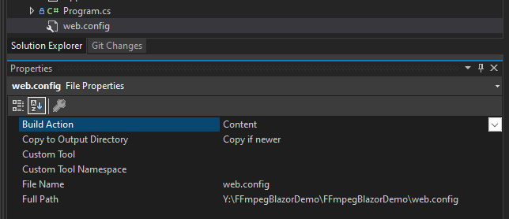

 Finally, you will have to run the application in `IIS Express`, otherwise you will still get the `SharedArrayBuffer not defined` exception, so let's change that so we do not forget later.

From:

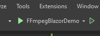  

To:

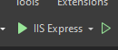  

Now we are ready to give it a try!

### Convert MP4 to MP3

The first demo we are going to do, is to replicate the sample code in the NuGet package docs, with some enhancements. We are going to extract the audio from an MP4 video, and create an MP3 audio file.

#### Logger Component

The sample demo in the NuGet package docs, is logging data to the browser's console logs, let's create a `Logger` component, so we can see the logs right on the page, as well as as progress indicator.

Add a *Logger.razor* component to the *Shared* folder, with the following code:

```c#
<div>
    <h3>Logs @Progress</h3>
    <textarea rows="@Rows" readonly 
        style="font-family:Lucida Sans Typewriter; font-size:12px;width:100%;">
        @LogMessages
    </textarea>
</div>

@code {
    [Parameter]
    public int Rows { get; set; } = 20;

    [Parameter]
    public string Progress { get; set; } = string.Empty;

    [Parameter]
    public string LogMessages { get; set; } = string.Empty;
}
```

As you can see, we have added three parameters `Rows` to indicate how many rows for the logging messages we can display, `Progress` to indicate completion progress when processing a file, and `LogMessages` to display logging entries.

Now, go to the *Pages/index.razor* page and replace the code with this code:

```c#
@page "/"
@using FFmpegBlazor
@inject IJSRuntime Runtime
@using Microsoft.AspNetCore.Components.Forms
@implements IDisposable

<PageTitle>Convert MP4 to MP3</PageTitle>

<h1>Convert MP4 to MP3</h1>
Extract audio from an MP4 video and create an MP3 audio file.
<br />
<br />
<div>
    <label for="videoFile">Video file:</label>
    <InputFile id="videoFile" OnChange="LoadVideoFile" />
</div>
<br />
<video width="300" autoplay controls src="@videoInputUrl" />
<br />
<br />
<input type="checkbox" @bind-value="@download" />&nbsp;Download Output File
<br />
<br />
<button class="btn btn-primary" @onclick="Process">Convert MP4 to MP3</button>
<br />
<br />
<audio controls src="@audioOutputUrl" />

<br />
<Logger LogMessages="@logMessages" Progress="@progressMessage" Rows="10"/>

@code
{
    FFMPEG? ffMpeg;
    byte[]? videoBuffer;
    string? videoInputUrl = string.Empty;
    string audioOutputUrl = string.Empty;
    string logMessages = string.Empty;
    string progressMessage = string.Empty;
    bool download = false;
    const string inputFile = "input.mp4";
    const string outputFile = "output.mp3";

    protected override async Task OnInitializedAsync()
    {
        // Wire-up events
        if (FFmpegFactory.Runtime == null)
        {
            FFmpegFactory.Logger += LogToConsole;
            FFmpegFactory.Progress += ProgressChange;
        }

        // Initialize Library
        await FFmpegFactory.Init(Runtime);
    }


    private async void LoadVideoFile(InputFileChangeEventArgs v)
    {
        // Clear logs and progress
        logMessages = string.Empty;
        progressMessage = string.Empty;

        // Get first file from input selection
        var file = v.GetMultipleFiles()[0];

        //Maximum size for file that can be read
        int maxSize = 100000000;

        // Read all bytes
        using var stream = file.OpenReadStream(maxSize); 
        videoBuffer = new byte[file.Size];

        // Read all bytes
        await stream.ReadAsync(videoBuffer);

        // Create a video link from the buffer, so that video can be played
        videoInputUrl = FFmpegFactory.CreateURLFromBuffer(videoBuffer, 
            inputFile, file.ContentType);

        // Re render DOM
        StateHasChanged();
    }

    private async void Process()
    {
        // Create an instance of FFmpeg
        ffMpeg = FFmpegFactory.CreateFFmpeg(new FFmpegConfig() { Log = true });

        // Download all dependencies from the CDN
        await ffMpeg.Load();

        if (!ffMpeg.IsLoaded) return;

        // Write buffer to in-memory files (special emscripten files,
        // FFmpegwasm only interacts with this file)
        ffMpeg.WriteFile(inputFile, videoBuffer);

        // Pass CLI argument here equivalent to ffmpeg -i inputFile.mp4 outputFile.mp3
        await ffMpeg.Run("-i", inputFile, outputFile);

        // Delete in-memory file
        ffMpeg.UnlinkFile(inputFile);
    }

    private async void ProgressChange(Progress message)
    {
        // Display progress % (0-1)
        // Cap the progress as it doesn't always report (0-1)
        var progressRatio = 
            message.Ratio <= 0 ? 0 : message.Ratio >= 100 ? 1 : message.Ratio;
        progressMessage = $"Progress: {progressRatio.ToString("P2")}";

        Console.WriteLine(progressMessage);
        LogToUi(progressMessage);

        // If FFmpeg processing is complete, generate a media URL so that it can be
        // played and/or downloaded
        if (message.Ratio == 1)
        {
            progressMessage = $"Progress: 100%";

            // Get a bufferPointer from C WASM to C#
            var res = await ffMpeg!.ReadFile(outputFile);

            // Generate a URL from the file bufferPointer
            audioOutputUrl = FFmpegFactory.CreateURLFromBuffer(res, outputFile, 
                "audio/mp3");

            // Download the file if required
            if (download)
            { 
                FFmpegFactory.DownloadBufferAsFile(res, outputFile, 
                    "audio/mp3");
            }

            // Rerender DOM
            StateHasChanged();
        }
    }

    private void LogToConsole(Logs message)
    {
        var logMessage = $"{message.Type} {message.Message}";
        Console.WriteLine(logMessage);
        LogToUi(logMessage);
    }

    private void LogToUi(string message)
    {
        logMessages += $"{message}\r\n";
        // Re-render DOM
        StateHasChanged();
    }

    public void Dispose()
    {
        FFmpegFactory.Logger -= LogToConsole;
        FFmpegFactory.Progress -= ProgressChange;
    }
}
```

Most of the code has comments, but some of the most important pieces are:

- Injecting `IJSRuntime` with `@inject IJSRuntime Runtime` to be able to call `FFmpegBlazor` JavaScript functions.
- Initialization of `FFmpegFactory` with `FFmpegFactory.Init(Runtime)`.
- Wiring-up of `Logger` and `Progress` events.
- Creating an instance of `FFmpeg` with `ffMpeg = FFmpegFactory.CreateFFmpeg(new FFmpegConfig() { Log = true });`.
- Executing `FFmpeg` functions like `WriteFile` and `Run`.

>:blue_book: With `ffMpeg.Run` we can potentially run any `FFmpeg` arguments available, which makes `FFmpegBlazor` very powerful. Refer to the official `FFmpeg` documentation [here](https://ffmpeg.org/ffmpeg.html) for more information.

Let's get rid of *Pages/FetchData.razor*, *Pages/Counter.razor*, and *Shared/SurveyPrompt.razor*, as we are not going to need them anymore.

Update *Pages/NavMenu.razor* with this code:

```c#
<div class="top-row ps-3 navbar navbar-dark">
    <div class="container-fluid">
        <a class="navbar-brand" href="">FFmpegBlazor Demo</a>
        <button title="Navigation menu" class="navbar-toggler" @onclick="ToggleNavMenu">
            <span class="navbar-toggler-icon"></span>
        </button>
    </div>
</div>

<div class="@NavMenuCssClass" @onclick="ToggleNavMenu">
    <nav class="flex-column">
        <div class="nav-item px-3">
            <NavLink class="nav-link" href="" Match="NavLinkMatch.All">
                <span class="oi oi-musical-note" aria-hidden="true"></span>
                    Convert MP4 to MP3
            </NavLink>
        </div>
    </nav>
</div>

@code {
    private bool collapseNavMenu = true;

    private string? NavMenuCssClass => collapseNavMenu ? "collapse" : null;

    private void ToggleNavMenu()
    {
        collapseNavMenu = !collapseNavMenu;
    }
}
```

Now let's run the app. You will be presented with this:

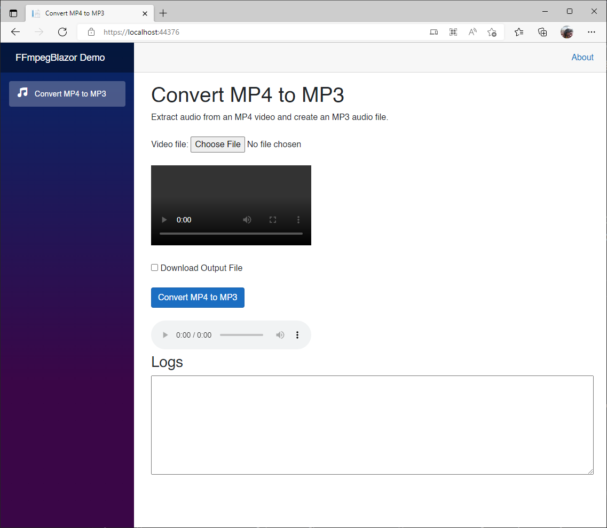  

Click on `Choose File` to select an MP4 video file. The file will load, and play on the Video player. You have the option to just convert the file to MP3, or convert, and download by checking the `Download Output File` box, let's check the box and click the `Convert MP4 to MP3` button.

After clicking the `Convert MP4 to MP3` button, you will see the log messages, the progress completed, the downloaded *output.mp3* file, and the Audio player ready to play the MP3 file.

  

Click `Play` on the Audio player to play the MP3 file, or click on the downloaded file in the browser to play it on your default audio player.

The audio track has been extracted from the MP4 video file. Nice!

So, what else can we do with `FFmpegBlazor`? How about create a video from an image file and an audio file? Let's do that now.

### Create Video

In this demo, we are going to create an MP4 video file from a single image, and an audio file. The output video will last the same time as the audio file.

Create a new *CreateMp4.razor* page and add the following code:

```c#
@page "/createMp4"
@using FFmpegBlazor
@inject IJSRuntime Runtime
@using Microsoft.AspNetCore.Components.Forms
@implements IDisposable

<PageTitle>Create Video</PageTitle>

<h1>Create Video</h1>
Create an MP4 video file from a single image, and an audio file. 
The output video will be as long as the audio file.
<br />
<br />
<div>
    <label for="imageFile">Image file:</label>
    <InputFile id="imageFile" OnChange="LoadImageFile" />
</div>
<br />

<br />
<br />
<div>
    <label for="audioFile">Audio file:</label>
    <InputFile id="audioFile" OnChange="LoadAudioFile" />
</div>
<br />
<audio controls src="@audioInputUrl" />
<br />
<br />
<input type="checkbox" @bind-value="@download" />&nbsp;Download Output File
<br />
<br />
<button class="btn btn-primary" @onclick="Process">Create Video</button>
<br />
<br />
<video width="300" autoplay controls src="@videoOutputUrl" />
<br />
<br />
<Logger LogMessages="@logMessages" Progress="@progressMessage" Rows="10"/>

@code
{
    FFMPEG? ffMpeg;
    byte[]? audioBuffer;
    byte[]? imageBuffer;
    string? imageInputUrl = string.Empty;
    string? audioInputUrl = string.Empty;
    string videoOutputUrl = string.Empty;
    string logMessages = string.Empty;
    string progressMessage = string.Empty;
    bool download = false;
    const string inputImageFile = "input.png";
    const string inputAudioFile = "input.mp3";
    const string outputFile = "output.mp4";
    //Max size for file that can be read
    const int maxSize = 100000000;

    protected override void OnInitialized()
    {
        // Wire-up events
        if (FFmpegFactory.Runtime != null)
        {
            FFmpegFactory.Logger += LogToConsole;
            FFmpegFactory.Progress += ProgressChange;
        }
        base.OnInitialized();
    }

    private async void LoadImageFile(InputFileChangeEventArgs i)
    {
        // Clear logs and progress
        logMessages = string.Empty;
        progressMessage = string.Empty;

        // Get first file from input selection
        var file = i.GetMultipleFiles()[0];


        
        // Read all bytes
        using var stream = file.OpenReadStream(maxSize);
        imageBuffer = new byte[file.Size];

        // Read all bytes
        await stream.ReadAsync(imageBuffer);

        // Create a video link from the buffer, so that video can be played
        imageInputUrl = FFmpegFactory.CreateURLFromBuffer(imageBuffer, 
            inputImageFile, file.ContentType);

        // Rerender DOM
        StateHasChanged();
    }

    private async void LoadAudioFile(InputFileChangeEventArgs a)
    {
        // Get first file from input selection
        var file = a.GetMultipleFiles()[0];

        // Read all bytes
        using var stream = file.OpenReadStream(maxSize);
        audioBuffer = new byte[file.Size];

        // Read all bytes
        await stream.ReadAsync(audioBuffer);

        // Create a video link from the buffer, so that video can be played
        audioInputUrl = FFmpegFactory.CreateURLFromBuffer(audioBuffer, 
            inputAudioFile, file.ContentType);

        // Re render DOM
        StateHasChanged();
    }

    private async void Process()
    {
        // Create an instance of FFmpeg
        ffMpeg = FFmpegFactory.CreateFFmpeg(new FFmpegConfig() { Log = true });

        // Download all dependencies from the CDN
        await ffMpeg.Load();

        if (!ffMpeg.IsLoaded) return;

        // Write buffer to in-memory files (special emscripten files,
        // FFmpeg only interacts with this file)
        ffMpeg.WriteFile(inputImageFile, imageBuffer);
        ffMpeg.WriteFile(inputAudioFile, audioBuffer);

        // Pass CLI argument here equivalent to ffmpeg -i image.png -i sound1.mp3 -r 30 -s 1280x720 -preset ultrafast -crf 25 movie.mp4
        await ffMpeg.Run("-i", inputImageFile, "-i", inputAudioFile, "-r", "30", "-s", "1280x720", "-preset", "ultrafast", "-crf", "25", outputFile);

        // Delete in-memory file
        ffMpeg.UnlinkFile(inputImageFile);
        ffMpeg.UnlinkFile(inputAudioFile);
    }

    private async void ProgressChange(Progress message)
    {
        // Display progress % (0-1)
        // Cap progress as it doesn't always reports (0-1)
        var progressRatio = 
            message.Ratio <= 0 ? 0 : message.Ratio >= 100 ? 1 : message.Ratio;
        progressMessage = $"Progress: {progressRatio.ToString("P2")}";

        Console.WriteLine(progressMessage);
        LogToUi(progressMessage);

        // If FFmpeg processing is complete, generate a media URL
        // so that it can be played and/or downloaded)
        if (message.Ratio == 1)
        {
            progressMessage = $"Progress: 100%";

            // Get a bufferPointer from C WASM to C#
            var res = await ffMpeg!.ReadFile(outputFile);

            // Generate a URL from the file bufferPointer
            videoOutputUrl = FFmpegFactory.CreateURLFromBuffer(res, 
                outputFile, "video/mp4");

            // Download the file
            if (download)
            {
                FFmpegFactory.DownloadBufferAsFile(res, 
                    outputFile, "video/mp4");
            }

            // Re render DOM
            StateHasChanged();
        }
        
    }

    private void LogToConsole(Logs message)
    {
        var logMessage = $"{message.Type} {message.Message}";
        Console.WriteLine(logMessage);
        LogToUi(logMessage);
    }

    private void LogToUi(string message)
    {
        logMessages += $"{message}\r\n";
        // Re render DOM
        StateHasChanged();
    }

    public void Dispose()
    {
        FFmpegFactory.Logger -= LogToConsole;
        FFmpegFactory.Progress -= ProgressChange;
    }
}
```

Add the following `NavLink` code to the *Pages/NavMenu.razor* page, below the `Convert MP4 to MP3` section:

```xml
<div class="nav-item px-3">
    <NavLink class="nav-link" href="createMp4">
        <span class="oi oi-image" aria-hidden="true"></span> Create Video
    </NavLink>
</div>
```

Run the app, and go to `Create Video`. Provide an image, an audio file, check the `Download Output File`, and press the `Create Video` button.

You just created a video based on an image, and an audio file.

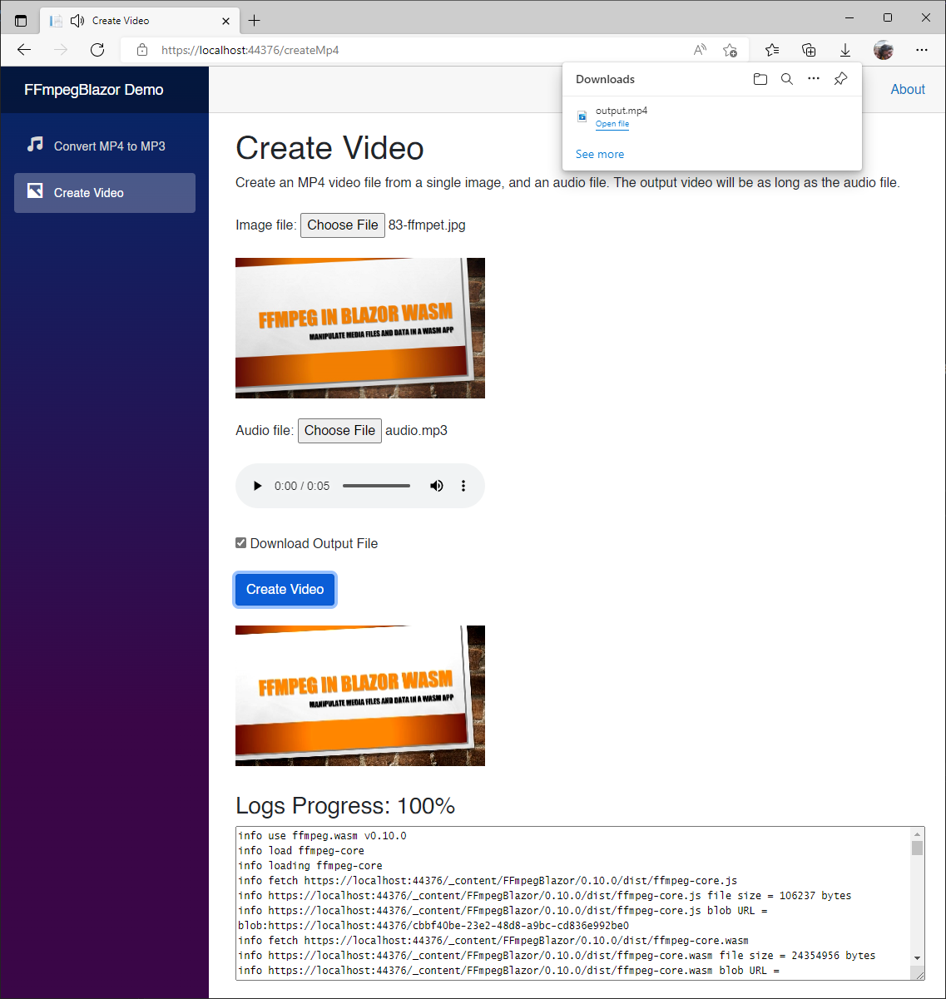  

Click `Play` on the Video player to play the MP4 file, or click on the downloaded file in the browser to play it on your default video player.

The video has been created from a single image and an audio file.

Now, let's add a watermark to an existing video.

### Video Watermark

Add a new *Watermark.razor* file and copy the following code:

```c#
@page "/watermark"
@using FFmpegBlazor
@inject IJSRuntime Runtime
@using Microsoft.AspNetCore.Components.Forms
@implements IDisposable

<PageTitle>Video Watermark</PageTitle>

<h1>Video Watermark</h1>
Add a watermark to a video.
<br />
<br />
<div>
    <label for="imageFile">Image watermark file:</label>
    <InputFile id="imageFile" OnChange="LoadImageFile" />
</div>
<br />

<br />
<br />
<div>
    <label for="videoFile">Video file:</label>
    <InputFile id="videoFile" OnChange="LoadVideoFile" />
</div>
<br />
<video width="300" autoplay controls src="@videoInputUrl" />
<br />
<br />
<input type="checkbox" @bind-value="@download" />&nbsp;Download Output File
<br />
<br />
<button class="btn btn-primary" @onclick="Process">Create Video Watermark</button>
<br />
<br />
<video width="300" hautoplay controls src="@videoOutputUrl" />
<br />
<br />
<Logger LogMessages="@logMessages" Progress="@progressMessage" Rows="10"/>

@code
{
    FFMPEG? ffMpeg;
    byte[]? imageBuffer;
    byte[]? videoBuffer;
    string? imageInputUrl = string.Empty;
    string? videoInputUrl = string.Empty;
    string videoOutputUrl = string.Empty;
    string logMessages = string.Empty;
    string progressMessage = string.Empty;
    bool download = false;
    const string inputImageFile = "input.png";
    const string inputVideoFile = "input.mp4";
    const string outputFile = "output.mp4";
    const int maxSize = 100000000;

    protected override void OnInitialized()
    {
        // Wire-up events
        if (FFmpegFactory.Runtime != null)
        {
            FFmpegFactory.Logger += LogToConsole;
            FFmpegFactory.Progress += ProgressChange;
        }
        base.OnInitialized();
    }

    private async void LoadImageFile(InputFileChangeEventArgs i)
    {
        // Clear logs and progress
        logMessages = string.Empty;
        progressMessage = string.Empty;

        // Get first file from input selection
        var file = i.GetMultipleFiles()[0];

        // Read all bytes
        using var stream = file.OpenReadStream(maxSize);
        imageBuffer = new byte[file.Size];

        // Read all bytes
        await stream.ReadAsync(imageBuffer);

        // Create a video link from the buffer, so that video can be played
        imageInputUrl = FFmpegFactory.CreateURLFromBuffer(imageBuffer,
            inputImageFile, file.ContentType);

        // Re render DOM
        StateHasChanged();
    }

    private async void LoadVideoFile(InputFileChangeEventArgs v)
    {
        // Get first file from input selection
        var file = v.GetMultipleFiles()[0];

        // Read all bytes
        using var stream = file.OpenReadStream(maxSize);
        videoBuffer = new byte[file.Size];

        // Read all bytes
        await stream.ReadAsync(videoBuffer);

        // Create a video link from the buffer,
        // so that video can be played and/or downloaded
        videoInputUrl = FFmpegFactory.CreateURLFromBuffer(videoBuffer, 
            inputVideoFile, file.ContentType);

        // Rerrender DOM
        StateHasChanged();
    }

    private async void Process()
    {
        // Create an instance of FFmpeg
        ffMpeg = FFmpegFactory.CreateFFmpeg(new FFmpegConfig() { Log = true });

        // Download all dependencies from the CDN
        await ffMpeg.Load();

        if (!ffMpeg.IsLoaded) return;

        // Write buffer to in-memory files (special emscripten files,
        // FFmpeg only interacts with this file)
        ffMpeg.WriteFile(inputImageFile, imageBuffer);
        ffMpeg.WriteFile(inputVideoFile, videoBuffer);

        // Pass CLI argument here equivalent to ffmpeg -i input.mp4
        // -i logo.png -filter_complex
        // "overlay=(main_w-overlay_w)/2:(main_h-overlay_h)/2" -codec:a copy output.mp4
        await ffMpeg.Run("-i", inputVideoFile, "-i", 
            inputImageFile, "-filter_complex", "overlay=0:0", "-codec:a", "copy", 
            outputFile);

        // Delete in-memory file
        ffMpeg.UnlinkFile(inputImageFile);
        ffMpeg.UnlinkFile(inputVideoFile);
    }

    private async void ProgressChange(Progress message)
    {
        // Display progress % (0-1)
        // Cap progress as it doesn't always report (0-1)
        var progressRatio = 
            message.Ratio <= 0 ? 0 : message.Ratio >= 100 ? 1 : message.Ratio;
        progressMessage = $"Progress: {progressRatio.ToString("P2")}";

        Console.WriteLine(progressMessage);
        LogToUi(progressMessage);

        // If FFmpeg processing is complete, generate a media URL
        // so that it can be played and/or downloaded)
        if (message.Ratio == 1)
        {
            progressMessage = $"Progress: 100%";

            // Get a bufferPointer from C WASM to C#
            var res = await ffMpeg!.ReadFile(outputFile);

            // Generate a URL from the file bufferPointer
            videoOutputUrl = FFmpegFactory.CreateURLFromBuffer(res, 
                outputFile, "video/mp4");

            // Download the file
            if (download)
            {
                FFmpegFactory.DownloadBufferAsFile(res, 
                    outputFile, "video/mp4");
            }

            // Re render DOM
            StateHasChanged();
        }
    }

    private void LogToConsole(Logs message)
    {
        var logMessage = $"{message.Type} {message.Message}";
        Console.WriteLine(logMessage);
        LogToUi(logMessage);
    }

    private void LogToUi(string message)
    {
        logMessages += $"{message}\r\n";
        // Re render DOM
        StateHasChanged();
    }

    public void Dispose()
    {
        FFmpegFactory.Logger -= LogToConsole;
        FFmpegFactory.Progress -= ProgressChange;
    }
}
```

Add the following `NavLink` code to the *Pages/NavMenu.razor* page, below the `Create Video` section:

```xml
<div class="nav-item px-3">
    <NavLink class="nav-link" href="watermark">
        <span class="oi oi-image" aria-hidden="true"></span> Video Watermark
    </NavLink>
</div>
```

Run the app, and go to `Video Watermark`. Provide an image, a video file, check the `Download Output File` and press the `Create Video Watermark` button.

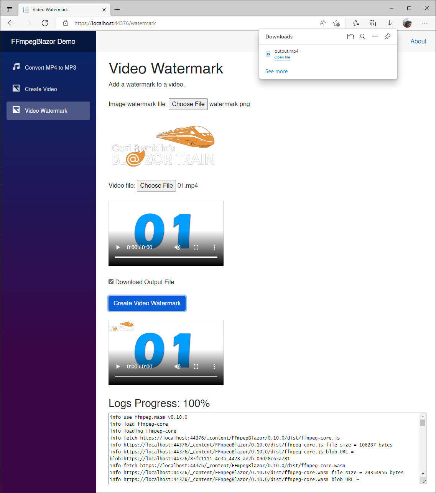  

You just added a watermark to a video. Just getting better and better huh?

Finally, how about concatenating two videos together? Let's do that now.

### Concatenate Videos

In this demo, we are going to take any two random videos, and concatenate them together, one after the other one.

Let's create *Pages/Concatenate.razor*, and add the following code:

```c#
@page "/concatenate"
@using FFmpegBlazor
@using Microsoft.AspNetCore.Components.Forms
@implements IDisposable

<PageTitle>Concatenate Videos</PageTitle>

<h1>Concatenate Videos</h1>
Concatenate two videos into one video.
<br />
<br />
<div>
    <label for="videoFile1">Video file 1:</label>
    <InputFile id="videoFile1" OnChange="LoadVideoFile1" />
</div>
<br />    
<video width="300" autoplay controls src="@videoInputUrl1" />

<div>
    <label for="videoFile2">Video file 2:</label>
    <InputFile id="videoFile2" OnChange="LoadVideoFile2" />
</div>
<br />
<video width="300" autoplay controls src="@videoInputUrl2" />
<br />
<br />
<input type="checkbox" @bind-value="@download" />&nbsp;Download Output File
<br />
<br />
<button class="btn btn-primary" @onclick="Process">Concatenate Videos</button>
<br />
<br />
<video width="300" autoplay controls src="@videoOutputUrl" />
<br />
<br />
<Logger LogMessages="@logMessages" Progress="@progressMessage" Rows="10" />

@code
{
    FFMPEG? ffMpeg;
    byte[]? videoBuffer1;
    byte[]? videoBuffer2;
    string videoInputUrl1 = string.Empty;
    string videoInputUrl2 = string.Empty;
    string videoOutputUrl = string.Empty;
    string logMessages = string.Empty;
    string progressMessage = string.Empty;
    bool download = false;
    const string inputFile1 = "videoInput1.mp4";
    const string inputFile2 = "videoInput2.mp4";
    const string outputFile = "output.mp4";
    const int maxSize = 100000000;

    protected override void OnInitialized()
    {
        // Wire-up events
        if (FFmpegFactory.Runtime != null)
        {
            FFmpegFactory.Logger += LogToConsole;
            FFmpegFactory.Progress += ProgressChange;
        }
        base.OnInitialized();
    }

    private async void LoadVideoFile1(InputFileChangeEventArgs v)
    {
        // Clear logs and progress
        logMessages = string.Empty;
        progressMessage = string.Empty;

        // Unlink files if previously called
        if (ffMpeg != null)
        {
            if (videoInputUrl1 != string.Empty)
            {
                videoInputUrl1 = "";
                ffMpeg.UnlinkFile(inputFile1);
            }

            if (inputFile2 != string.Empty)
            {
                videoInputUrl2 = "";
                ffMpeg.UnlinkFile(inputFile2);
            }
        }

        // Get first file from input selection
        var file = v.GetMultipleFiles()[0];

        // Read all bytes
        using var stream = file.OpenReadStream(maxSize);
        videoBuffer1 = new byte[file.Size];

        // Read all bytes
        await stream.ReadAsync(videoBuffer1);

        // Create a video link from the buffer,
        // so that video can be played and/or downloaded
        videoInputUrl1 = FFmpegFactory.CreateURLFromBuffer(videoBuffer1,
            inputFile1, file.ContentType);

        // Re render DOM
        StateHasChanged();
    }

    private async void LoadVideoFile2(InputFileChangeEventArgs v)
    {
        // Get first file from input selection
        var file = v.GetMultipleFiles()[0];

        // Read all bytes
        using var stream = file.OpenReadStream(maxSize);
        videoBuffer2 = new byte[file.Size];

        // Read all bytes
        await stream.ReadAsync(videoBuffer2);

        // Create a video link from the buffer,
        // so that video can be played and/or downloaded
        videoInputUrl2 = FFmpegFactory.CreateURLFromBuffer(videoBuffer2,
            inputFile2, file.ContentType);

        // Re render DOM
        StateHasChanged();
    }

    private async void Process()
    {
        // Create an instance of FFmpeg
        ffMpeg = FFmpegFactory.CreateFFmpeg(new FFmpegConfig() { Log = true });

        // Download all dependencies from the CDN
        await ffMpeg.Load();

        if (!ffMpeg.IsLoaded) return;

        // Write buffer to in-memory files (special emscripten files,
        // FFmpeg only interacts with this file)
        ffMpeg.WriteFile(inputFile1, videoBuffer1);
        ffMpeg.WriteFile(inputFile2, videoBuffer2);

        // Pass CLI argument here equivalent to ffmpeg -i inputFile1.mp4
        // -i inputFile2.mp4 outputFile.mp3 -filter_complex concat=n=2:v=1:a=0
        // -vn -y output.mp4
        await ffMpeg.Run("-i", inputFile1, "-i",
            inputFile2, "-filter_complex", "concat=n=2:v=1:a=0",
            "-vn", "-y", outputFile);

        // Delete in-memory files
        ffMpeg.UnlinkFile(inputFile1);
        ffMpeg.UnlinkFile(inputFile2);
    }

    private async void ProgressChange(Progress message)
    {
        // Display progress % (0-1)
        // Cap progress as it doesn't always report (0-1)
        var progressRatio =
            message.Ratio <= 0 ? 0 : message.Ratio >= 100 ? 1 : message.Ratio;
        progressMessage = $"Progress: {progressRatio.ToString("P2")}";

        Console.WriteLine(progressMessage);
        LogToUi(progressMessage);

        // If FFmpeg processing is complete, generate a media URL
        // so that it can be played and/or downloaded)
        if (message.Ratio == 1)
        {
            progressMessage = $"Progress: 100%";

            // Get a bufferPointer from C WASM to C#
            var res = await ffMpeg!.ReadFile(outputFile);

            // Generate a URL from the file bufferPointer
            videoOutputUrl = FFmpegFactory.CreateURLFromBuffer(res,
                outputFile, "video/mp4");

            // Download the file
            if (download)
            {
                FFmpegFactory.DownloadBufferAsFile(res,
                    outputFile, "video/mp4");
            }

            // Re render DOM
            StateHasChanged();
        }
    }

    private void LogToConsole(Logs message)
    {
        var logMessage = $"{message.Type} {message.Message}";
        Console.WriteLine(logMessage);
        LogToUi(logMessage);
    }

    private void LogToUi(string message)
    {
        logMessages += $"{message}\r\n";
        // Re render DOM
        StateHasChanged();
    }

    public void Dispose()
    {
        FFmpegFactory.Logger -= LogToConsole;
        FFmpegFactory.Progress -= ProgressChange;
    }
}
```

Add a new `NavLink` to the **Pages/NavMenu.razor** file, below the `Video Watermark` section.

```xml
<div class="nav-item px-3">
    <NavLink class="nav-link" href="concatenate">
        <span class="oi oi-video" aria-hidden="true"></span> Concatenate Videos
    </NavLink>
</div>
```

Now run the application.

After selecting two videos, checking the `Download Output File` box, and clicking the `Concatenate Videos` button, you will be able to see the concatenated video on the third video component, as well in the downloads.

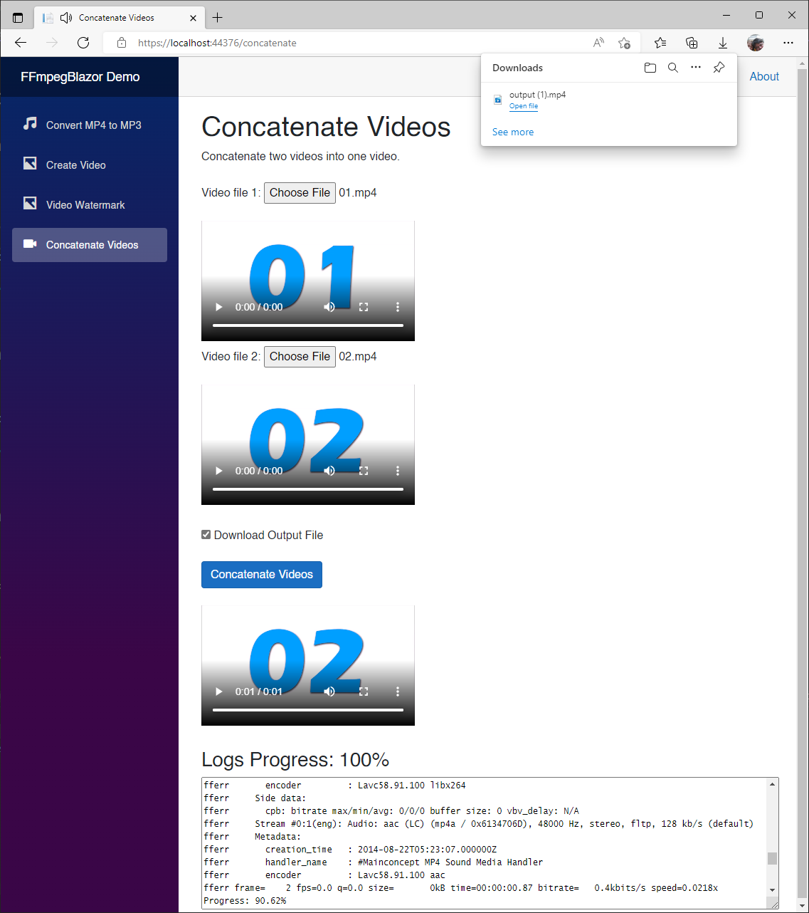  

You can press play on the third video component, or click on the downloaded file by the browser to see the end results.

## Summary

In this episode, we saw how to edit videos, and audio using `FFmpegBlazor` in a Blazor WebAssembly application.

We were able to extract the audio track of an MP4 video and create an MP3 audio file, create an MP4 video from a single image and an audio track, add a watermark to a video, and concatenate two videos into one.

Most importantly, we learned how easily we can leverage `FFmpegBlazor` to basically use any functionally provided by `FFmpeg` in a Blazor WebAssembly application. Now, that's powerful!

For more information about `FFmpeg`, and `FFmpegBlazor`, check the links in the resources section below.

## Complete Code

The complete code for this demo can be found in the link below.

- <https://github.com/carlfranklin/FFmpegBlazorDemo>

## Resources

| Resource Title                   | Url                                                                        |
| -------------------------------- | -------------------------------------------------------------------------- |
| The .NET Show with Carl Franklin | <https://www.youtube.com/playlist?list=PL8h4jt35t1wgW_PqzZ9USrHvvnk8JMQy_> |
| Download .NET                    | <https://dotnet.microsoft.com/en-us/download>                              |
| FFmpegBlazor                     | <https://github.com/sps014/FFmpegBlazor>                                   |
| FFmpegBlazor NuGet Package       | <https://www.nuget.org/packages/FFmpegBlazor/>                             |
| FFmpeg Documentation             | <https://ffmpeg.org/ffmpeg.html>                                           |
